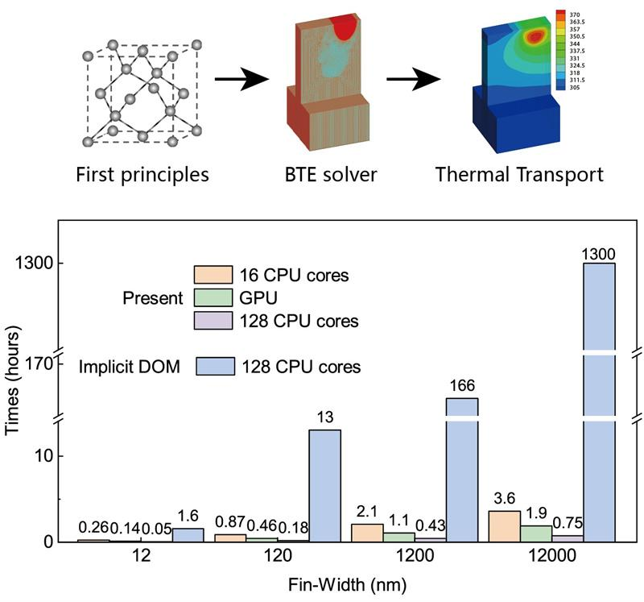
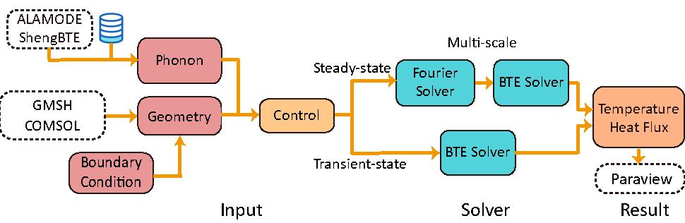

# 1. About

## 1.1 What is GiftBTE?
GiftBTE is a powerful tool designed to investigate submicron heat conduction. At the submicron scale, the characteristic length of heat conduction becomes comparable to the phonon mean free path, rendering the macroscopic Fourier's law inapplicable. Instead, at this scale, the phonon Boltzmann transport equation accurately describes heat conduction. GiftBTE employs numerical methods to solve this equation and simulates submicron heat conduction. It takes phonon properties from first-principles simulations as input and provides a built-in database for some materials. Additionally, GiftBTE offers an interface with two external unstructured mesh generators. The tool is easy to use, as it only requires an environment with g++, MPI, and Cmake.

## 1.2 Features

**General**
- Deterministic solver of phonon Boltzmann transport equation
- Applicable to any crystalline materials and structures
- Applicable to steady-state and transient problem
- Interface to ShengBTE, ALAMODE, GMSH, COMSOL, and Paraview packages
- Mainly written in C++, parallelized in MPI
 
**Applications**
- Computing thermal conductivity of nanostructures such as nano-porous media, superlattice, nanowires, nano-composite
- Predicting temperature rise in transistors
- Simulating laser heating process
- Other submicron heat conduction problems
 
 
**WorkFlow**

**Code structure**   

## 1.3 Links

- Documentation: [Gift-BTE用户文档](https://sjtu.feishu.cn/docx/GzB2dXQfaozenFxEtP4cQEJOnKb)
- Git repository: [https://github.com/Gift-BTE-developer/Gift-BTE.git](https://github.com/Gift-BTE-developer/Gift-BTE.git)
 

## 1.4 License

This software is distributed under the **GNU General Public License v3.0** license. See the LICENSE.txt file for license rights and limitations.

## 1.5 How to cite GiftBTE

Please cite the following article when you use GiftBTE
 
## 1.6 Issues & Bug report
- If you find a bug or issue related to GiftBTE, please report it at [Github Issues](https://github.com/Gift-BTE-developer/Gift-BTE/issues)
- Other questions and suggestions can be posted on the [Github Disccusions](https://github.com/Gift-BTE-developer/Gift-BTE/discussions)
 
In either case, please search for the previous questions and read the FAQ page of this document before asking.

## 1.7 Acknowledgment

This project is/was partially supported by the following projects:

- National Key R \& D Project from Ministery of Science and Technology of China (Grant No. 2022YFA1203100)
- National Natural Science Foundation of China (Grant No. 52122606)
 
## 1.8 Contributors & Contact
 
TPEC Lab (Contact: Gift-BTE@outlook.com)

Website: [https://sites.ji.sjtu.edu.cn/hua-bao/](https://sites.ji.sjtu.edu.cn/hua-bao/)

Global Institute of Future Technology (GIFT)

Shanghai Jiao Tong University

China
