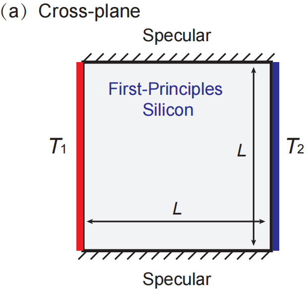
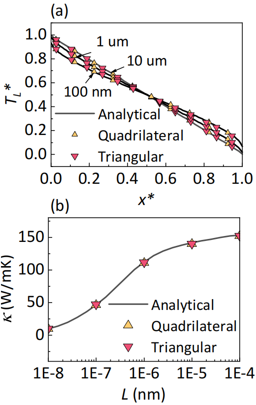
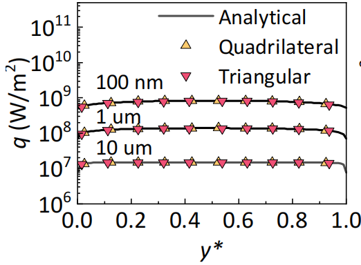
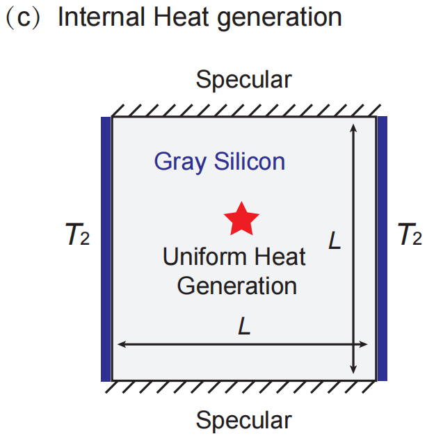
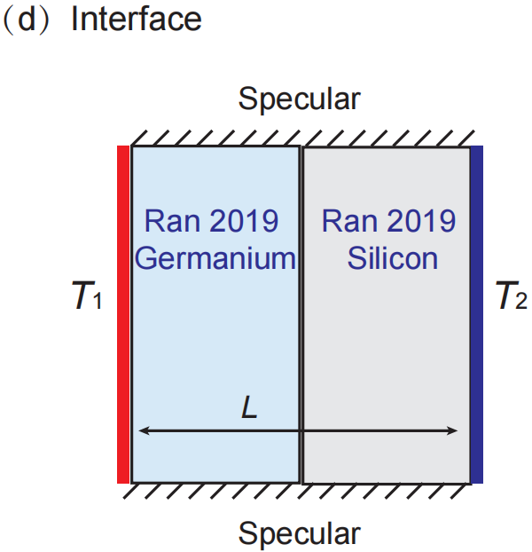
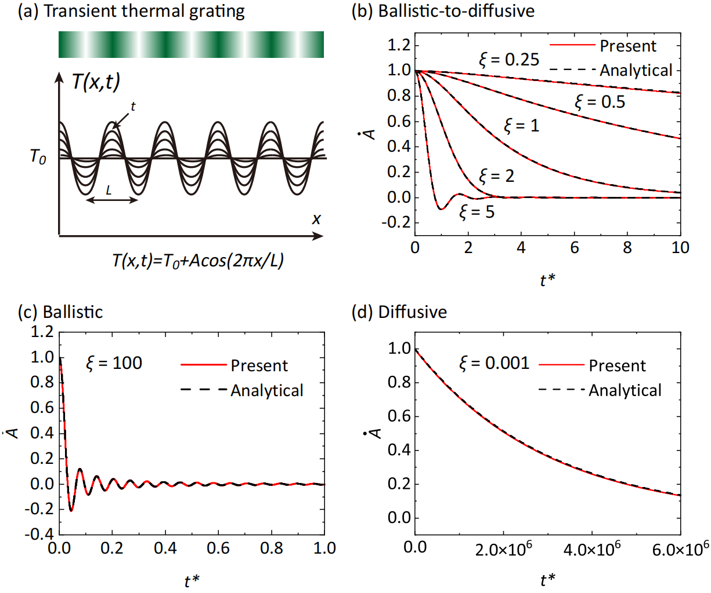
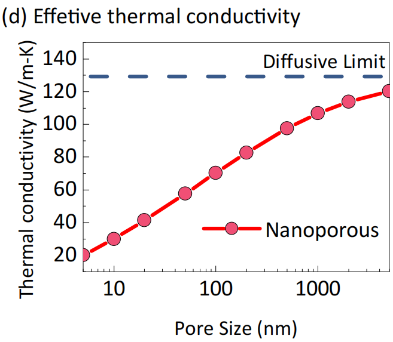
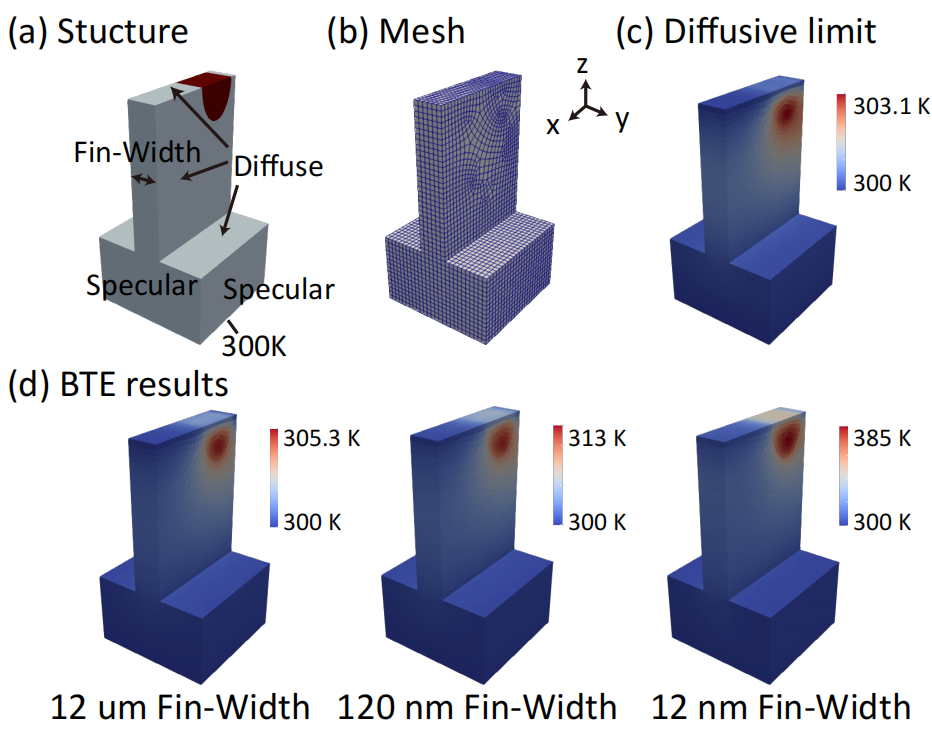

# 5. Examples

The examples folder in bin/ gives input files for some toy problems, including cross-plane heat conduction in Si thin films, in-plane heat conduction in Si thin films, internal heat generation in Si thin films, and thermal transport across Ge-Si interface, thermal conduction in nano-porous media, thermal conduction in silicon Fin field-effect transistors, etc.

## 5.1 Cross-plane heat conduction

A square simulation domain with length L for cross-plane heat conduction in Si thin films [1] is shown below: thermalizing boundary conditions with temperatures T₁ and T₂ are set at the left and right boundaries, respectively. The top and bottom boundaries are set as specularly reflecting boundary conditions.

The folder **examples\cross-plane** includes input files for three different Si thin film thicknesses (**L=1e-6, 1e-7, 1e-8 m**). The results (the lattice temperature and heat flux) calculated from GiftBTE verified with analytical solutions are shown below.

## 5.2 In-plane heat conduction

The simulation domain for in-plane heat conduction in Si thin film [2] with the thickness of L is shown below. Periodic boundary conditions are set at the left and right boundaries with a temperature difference, which induces a temperature gradient over the x direction. The top and bottom boundaries are set as diffusely reflecting boundary conditions.

The folder **examples\in-plane** includes input files for three different Si thin film thicknesses (**L=1e-6, 1e-7, 1e-8 m**). The results (the heat flux along the y axis) calculated from GiftBTE verified with analytical solutions are shown below.

## 5.3 Internal heat generation

The simulation domain for uniform internal heat generation in the entire Si thin film [3] with the length of L is shown below. Thermalizing boundary conditions with the same temperature T₂ are set at the left and right boundaries, while the top and bottom boundaries are set as specularly reflecting boundary conditions.

The folder **examples\heat-generation** includes input files for three different Si thin film thicknesses (**L=1e-5, 1e-6, 2e-7 m**) with the same uniform internal heat generation. The results (the lattice temperature along the x axis) calculated from GiftBTE verified with numerical results from previous references [3] are shown below.

## 5.4 Thermal transport across interfaces

The simulation domain for thermal transport across Si-Ge interface [4] with the total length of L is shown below. Thermalizing boundary conditions with temperatures T₁ and T₂ are set at the left and right boundaries, respectively. The top and bottom boundaries are set as specularly reflecting boundary conditions. The left-side material is set as Ge, and the right-side material is set as Si.

The folder **examples\interface** includes input files for three different total lengths of the Si-Ge interface  (**L=20, 50, 220 nm**). The results (the lattice temperature and interfical thermal conductance) calculated from GiftBTE verified with numerical results from previous references [4] are shown below.

## 5.5 One-dimensional transient thermal grating (TTG)

Transient heat conduction for one-dimensional transient thermal grating (TTG) problem [5] is shown below (Fig.(a)). A spatially sinusoidal temperature variation is set initially as given by the equation in Fig. (a). T₀ is the background temperature, A₀ is the amplitude of the temperature variation, and L is the grating period. ξ is defined as ξ = 2πKn, where Kn is the Knudsen number defined as Kn = vτ/L. As time progresses, the amplitude of the spatially sinusoidal temperature variation decreases. In our BTE computations, we study one period and set the left and right boundaries as periodic boundary conditions.

The folder **examples\TTG** includes input files for seven different length periods  (**ξ=0.001, 0.25, 0.5, 1, 2, 5, 100**). These seven cases range from ballistic regime to diffusive regime. Fig.(b-d) show the amplitude of the temperature variation A/A₀ at different times calculated from GiftBTE, where t∗ represents the dimensionless time, defined as t/τ.

## 5.6 Thermal conduction in nano-porous media

The structure and computational domain of a sample of nanoporous media are depicted below (Fig. (a)), while the porosity of the material is determined to be 15.7%. A single period of the nano-porous media is extracted to facilitate computation, employing periodic boundary conditions on all outer boundaries. Additionally, a temperature difference of 1 K is imposed between the left and right boundaries, resulting in a temperature gradient along the x direction. The surface of the pore is treated as a diffuse boundary.

The folder **examples\nanoporous** includes input files for porous media with three different pore sizes (**50, 500, 5000nm**). Fig.(b-c) show the temperature profiles and heat flux profiles (along the x direction) calculated from the GiftBTE. The calculated effective thermal conductivity values for different periods are also shown below.

## 5.7 Temperature profiles in Fin field-effect transistors

The structure and boundary conditions of a silicon FinFET are illustrated in Fig. (a), which are adapted from a previous study [6]. The thermalizing boundary, in contact with the metal electrode (source and drain) or away from the hot spot (substrate), is set at 300 K to simulate a room temperature environment. The diffusely reflecting boundary, in contact with the amorphous Si oxide, is set at the boundary in contact with the dielectric layer. The other boundaries are set as specularly reflecting boundaries to mimic the symmetric boundary between devices. The hot spot is set as a semi-ellipse.

The folder **examples\FinFET** includes input files for silicon FinFET with three different Fin widths (**1200, 120, 12nm**). Fig.(d) show the temperature profiles in the FinFET calculated from the GiftBTE.

## 5.8 Simulations of Time-domain thermoreflectance (TDTR) experiment

The structure of the TDTR experiment is depicted in Fig. (a), where an ultra-fast modulated pulsed laser directly illuminates the semiconductor [7]. The computational domain and set of boundary conditions are illustrated in Fig. (b). Due to symmetry, we simulated a quarter of the entire system, as each side of the cube is 50 µm. The top boundary represents the surface of the semiconductor and is set as a diffusely reflecting boundary. The two inner boundaries are set as specularly reflecting boundaries to capture the system’s symmetry. The remaining three boundaries are set at 300 K to simulate a room temperature environment. As shown in Fig. (c), the pump beam pulses repeat at a frequency of frep and are modulated into a sinusoidal shape with a frequency of fmod, which induces heat source in the semiconductor.

The folder **examples\TDTR** includes input files for simulating TDTR experiments with frep=80MHz, fmod=10MHz and a pump beam radius w₀=3.8μm. Fig.(d) show the GiftBTE calculated average temperature within the pump beam at the surface of the semiconductor at different times.